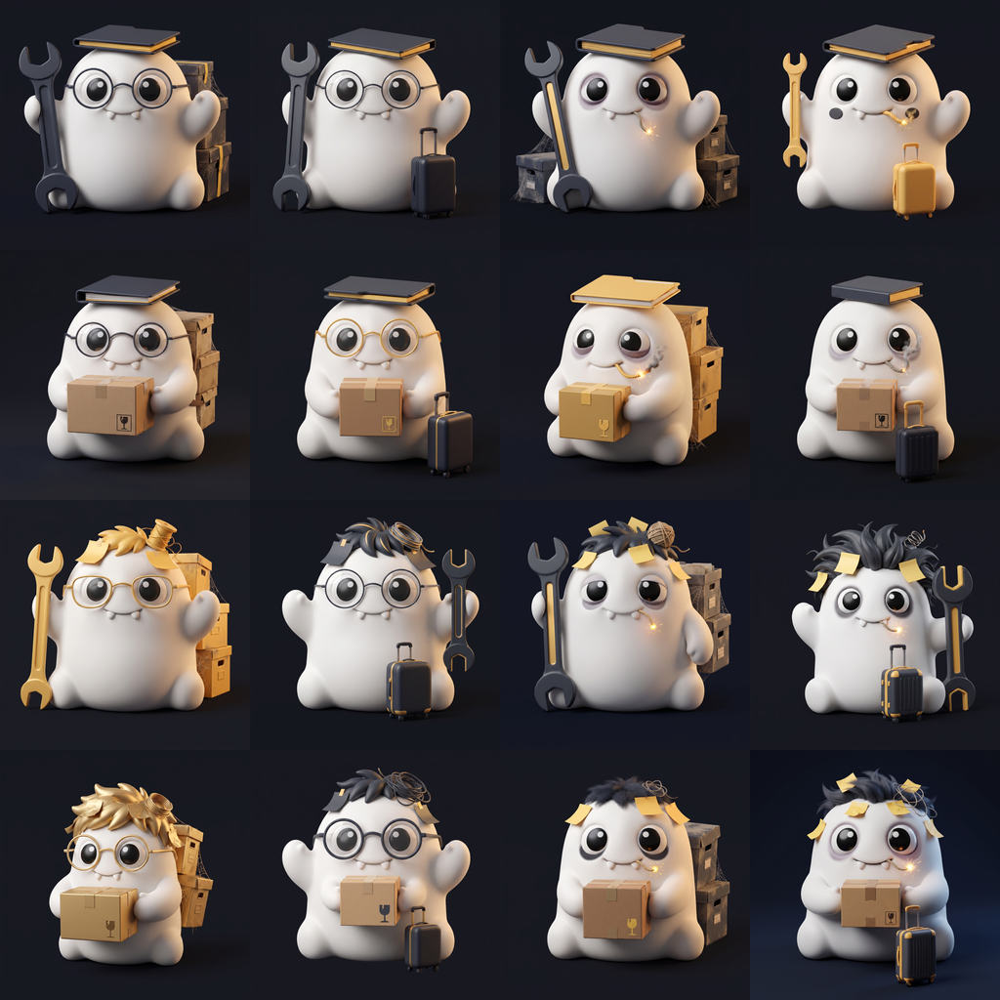

# AI 人事部

> AI 接管世界之后，你会被分配到什么岗位？

[English](README.md)

这是一个装在你电脑上的技能包。它扫一遍你的文件目录，然后以「AI 人事部」的名义，给你签发一份《人类安置通知书》——判定你属于 16 型中的哪一型，并附上判定依据。

最后你会拿到一张可以直接发朋友圈的卡片图。

## 它的核心判据

**整理得越好，越容易被替代。**

因为你把工作整理清晰的那一刻，就已经替 AI 完成了最难的部分。反过来，那些命名混乱、层级失控、只有本人看得懂的目录，AI 学不会。

所以在这套判定里，混乱是护城河。

## 隐私：靠结构，不靠承诺

这是本项目最要紧的一件事，也是它敢开源的原因。

采集脚本 [`plugins/ai-hr/scripts/scan.py`](plugins/ai-hr/scripts/scan.py) 只有一百多行，纯 Python 标准库，**你可以完整读完它**。它输出的 JSON 里**根本没有存放文件名的字段**——只有数字、扩展名和固定的枚举键。

这意味着：**不是「我们承诺不看你的文件名」，而是大模型从头到尾就没有机会接触到任何文件名、路径或人名。** 隐私是输出结构的属性，不是一句写在条款里的保证。

技能说明里同时写死了一条硬规则：只允许通过这个脚本了解你的文件系统，禁止自行列目录。

脚本对你的磁盘只读，不写入、不移动、不删除任何东西。

这套论点的完整版（英文，含对 `scan.py` 的逐行引用）在 [docs/privacy-by-structure.md](docs/privacy-by-structure.md)。

### 别信我说的——让你的智能体自己审

`scan.py` 短到任何一个像样的智能体都能在安装前把它整个读完。我们实测安装时，WorkBuddy 没人要求就自己做了一遍代码审计，然后报告：只有 `os.listdir` / `os.walk` / `os.stat` 三个只读调用，无写入、无网络请求、无 `subprocess` / `eval` / `exec`；技能文件里没有提示注入、没有外传指令。它自己对输出结构给出的结论是——**隐私是结构保证，不是承诺**。

装之前让你的智能体也审一遍。采集脚本写得这么小，就是为了让这件事做得到。

## 安装

需要 [WorkBuddy](https://www.workbuddy.cn/)（或其他兼容 OpenClaw 技能格式的桌面智能体）。

**最简单的方式——直接让它自己装。** 把这句话发给它：

> 请帮我安装一下这个项目 https://github.com/GiaSip/ai-hr ，然后帮我试一下

这是我们实测通过的原话。它会自己读仓库、审代码、装好技能并跑一遍——一条消息，不用找菜单，不用打开插件市场。

**或者把它注册成插件市场**（这样才有版本更新提示）：在 WorkBuddy 的「添加市场」里填 `GiaSip/ai-hr`，填完整网址也行，然后安装 `ai-hr` 插件。

两种方式装完，都用这句触发：

> 给我的电脑画个像

也可以说「AI 人事部」「我会被 AI 替代吗」「测测我是什么型」。

运行环境不需要你准备——WorkBuddy 自带 Python。

## 16 型

四个二元轴，组合出 16 型，每型一个四字母代码：

| 轴 | 含义 |
|---|---|
| **R / C** | 结构：规整 ↔ 混沌 |
| **M / K** | 产出：造东西 ↔ 囤东西 |
| **S / B** | 节奏：稳定 ↔ 突发 |
| **A / F** | 时间：考古层厚 ↔ 轻装上阵 |

比如 **RMBA「节点爆破手」**：平日静如死机，一到节点就从历史层里精准调取模板、拼装出规整成品——像一株只在截止日前三天开花的植物。

其中 4 型标记为稀有。稀有的判据是「极度矛盾的特质组合」，不是某个指标的极端值。

### 16 只质子

每一型都配了一只**质子**——AI 人事部提前派到你电脑里的小东西。16 只共用同一个身体，只靠配件区分，每条轴一个槽位：

| 轴 | 槽位 | 规整 / 造 / 稳定 / 考古 | 混沌 / 囤 / 突发 / 轻装 |
|---|---|---|---|
| R / C | 头顶 | 一个归好档的文件夹 | 炸开的乱发和便利贴 |
| M / K | 手部 | 一把巨型扳手 | 抱在胸前的纸箱 |
| S / B | 面部 | 圆框眼镜 | 嘴里咬着点燃的引信，黑眼圈 |
| A / F | 背后 | 落灰结网的档案箱 | 一只迷你拉杆箱 |

四个稀有型的配件是金色的。

卡片上画的就是你的质子，判词会告诉你 16 只里抽到的是哪一只。插件内的 PNG 在 `plugins/ai-hr/assets/mascots/`；2K 原图、配件对比图和全部生成 prompt 在 `docs/design/mascots/`。

## 关于判词

判词可以毒、可以冒犯——社交传播吃的就是冒犯，太温和没有转发的理由。

但有条底线：**只针对你堆文件的方式，不针对人**。不涉及外貌、性别、地域、收入。目标是让你笑着骂一句，然后截图发出去，而不是让你真的难受。

所有判定都是「预审」性质：评的是未来 AI 的用人偏好，不是现在的你。

## License

MIT
